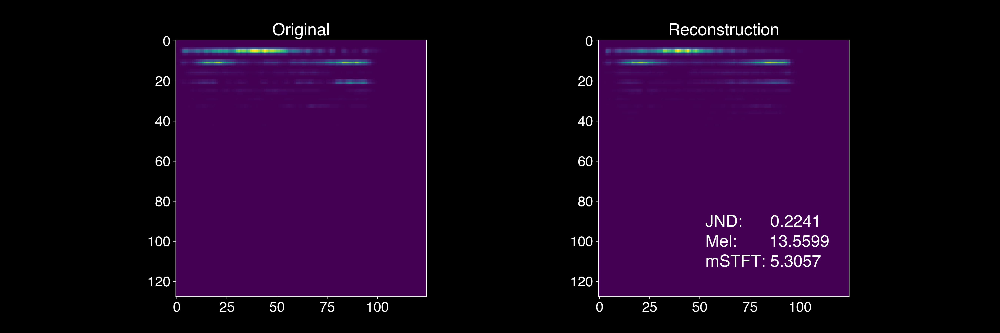
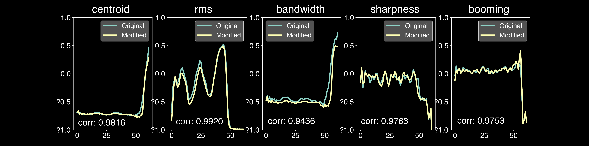
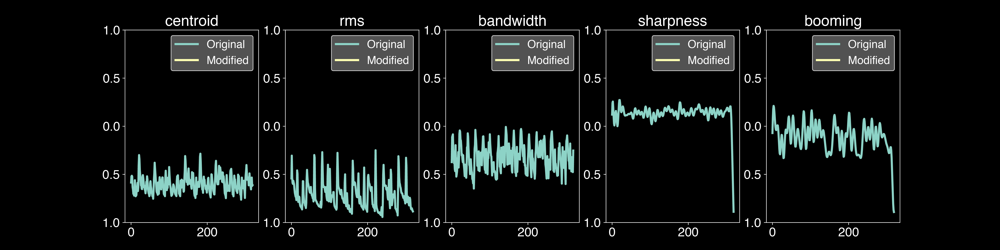
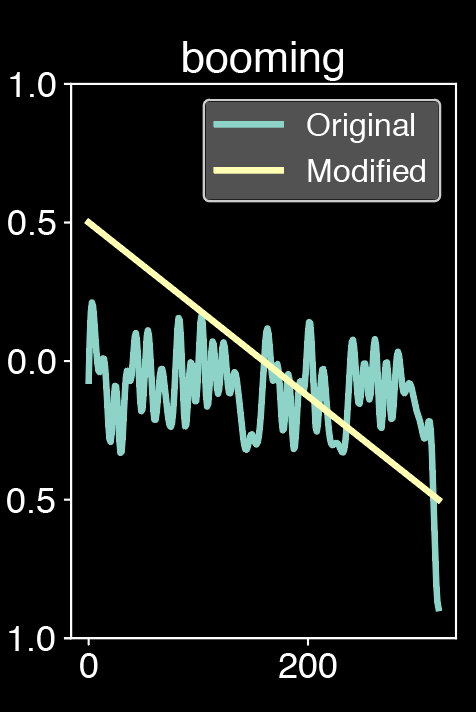
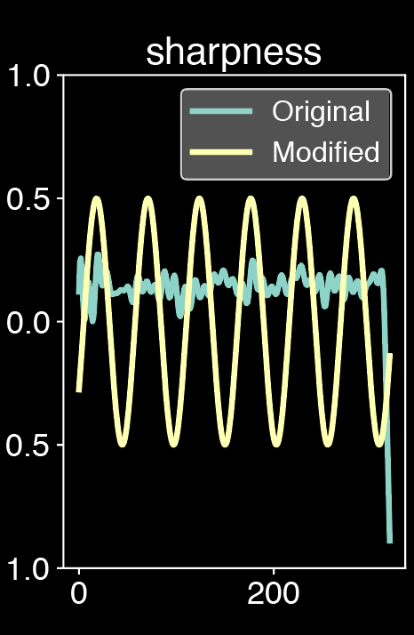
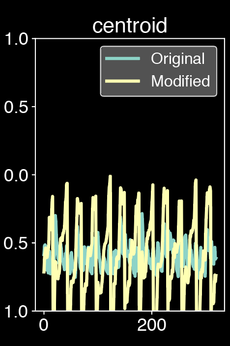
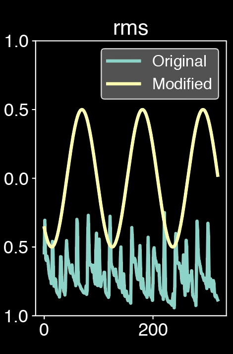
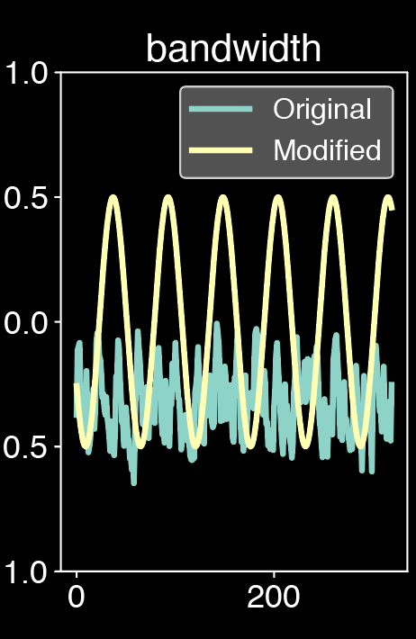

 

**This website is still under construction. We keep adding new results, so please come back later if you want more.**

This website presents additional material and experiments around the paper *Continuous descriptor-based control for deep audio synthesis*.

Despite significant advances in deep models for music generation, the use of these techniques remains restricted to expert users. Before being democratized among musicians, generative models must first provide _expressive control_ over the generation, as this conditions the integration of deep generative models in creative workflows. In this paper, we tackle this issue by introducing a deep generative audio model providing expressive and continuous descriptor-based control, while remaining lightweight enough to be embedded in a hardware synthesizer. We enforce the controllability of real-time generation by explicitly removing salient musical features in the latent space using an adversarial confusion criterion. User-specified features are then reintroduced as additional conditioning information, allowing for _continuous_ control of the generation, akin to a synthesizer knob. We assess the performance of our method on a wide variety of sounds including instrumental, percussive and speech recordings while providing both _timbre_ and _attributes_ transfer, allowing new ways of generating sounds. 

**Examples contents**
  * [Audio reconstruction](#audio-reconstruction)
  * [Single attribute control](#single-attribute-control)
  * [Timbre and attribute transfers](#timbre-transfers)
  

**Additional details**
  * [Comparison with DDSP](#comparison-with-ddsp)
  * [Japanese dataset evaluation](#japanese-dataset-evaluation)

**Code and implementation**
  * [Hardware embedding](#hardware-embedding)
  * [Source code](#code)

## Audio reconstruction

First, we compare the quality of our models to perform pure reconstruction of an input from the test set, depending on whether it uses *conditioning* (*C-*) or *faders* (*F-*). Those models were computed on the *Darbuka* and *NSynth* datasets.

    <table style="width:100%;">
        <tr>
            <th style="width:50px"><b>Darbuka</b></th>
            <th>Original</th>
            <th>Reconstruction</th>
        </tr>
        <tr>
            <td>C-Rave</td>
            <td>
                <audio controls> 
                    <source src="audio/darbouka_c_darbouka_original.wav">
                </audio>
            </td>
            <td>
                <audio controls> 
                    <source src="audio/darbouka_c_darbouka_reconstruct.wav">
                </audio>
            </td>
        </tr>
        <tr>
            <td>F-Rave</td>
            <td>
                <audio controls> 
                    <source src="audio/darbouka_darbouka_original.wav">
                </audio>
            </td>
            <td>
                <audio controls> 
                    <source src="audio/darbouka_darbouka_reconstruct.wav">
                </audio>
            </td>
        </tr>
    </table>

    <table style="width:100%;">
        <tr>
            <th style="width:50px"><b>NSynth</b></th>
            <th>Original</th>
            <th>Reconstruction</th>
        </tr>
        <tr>
            <td>C-Rave</td>
            <td>
                <audio controls> 
                    <source src="audio/nsynth_c_nsynth_original.wav">
                </audio>
            </td>
            <td>
                <audio controls> 
                    <source src="audio/nsynth_c_nsynth_reconstruct.wav">
                </audio>
            </td>
        </tr>
        <tr>
            <td>F-Rave</td>
            <td>
                <audio controls> 
                    <source src="audio/nsynth_nsynth_original.wav">
                </audio>
            </td>
            <td>
                <audio controls> 
                    <source src="audio/nsynth_nsynth_reconstruct.wav">
                </audio>
            </td>
        </tr>
    </table>

 

In order to exploit the artistic potential of our method, we performed extended experiments on other datasets than those presented in the paper. We selected a Japanese voice dataset to extend the performance of SC09, which may be limited for attribute exchange or timbre transfer, and we selected a violin dataset to get rid of the monophonic and short unique note of Nsynth. For the *SC09*, *Japanese* and *Violin* datasets, we only present the results of our proposed *F-Rave* model.

    <table style="width:100%;">
        <tr>
            <th style="width:50px"><b>SC09</b></th>
            <th>Original</th>
            <th>Reconstruction</th>
        </tr>
        <tr>
            <td></td>
            <td>
                <audio controls> 
                    <source src="audio/sc09/5_original.wav">
                </audio>
            </td>
            <td>
                <audio controls> 
                    <source src="audio/sc09/5_reconstruction.wav">
                </audio>
            </td>
        </tr>
        <tr>
            <td></td>
            <td>
                <audio controls> 
                    <source src="audio/sc09/one_original.wav">
                </audio>
            </td>
            <td>
                <audio controls> 
                    <source src="audio/sc09/one_reconstructin.wav">
                </audio>
            </td>
        </tr>
    </table>

    <table style="width:100%;">
        <tr>
            <th style="width:50px"><b>Japan</b></th>
            <th>Original</th>
            <th>Reconstruction</th>
        </tr>
        <tr>
            <td></td>
            <td>
                <audio controls> 
                    <source src="audio/japanese_japanese_original.wav">
                </audio>
            </td>
            <td>
                <audio controls> 
                    <source src="audio/japanese_japanese_reconstruct.wav">
                </audio>
            </td>
        </tr>
        <tr>
            <td></td>
            <td>
                <audio controls> 
                    <source src="audio/japanese_japanese_2_original.wav">
                </audio>
            </td>
            <td>
                <audio controls> 
                    <source src="audio/japanese_japanese_2_reconstruct.wav">
                </audio>
            </td>
        </tr>
    </table>

    <table style="width:100%;">
        <tr>
            <th style="width:50px"><b>Violin</b></th>
            <th>Original</th>
            <th>Reconstruction</th>
        </tr>
        <tr>
            <td></td>
            <td>
                <audio controls> 
                    <source src="audio/violin_violin_original.wav">
                </audio>
            </td>
            <td>
                <audio controls> 
                    <source src="audio/violin_violin_reconstruct.wav">
                </audio>
            </td>
        </tr>
        <tr>
            <td></td>
            <td>
                <audio controls> 
                    <source src="audio/violin_violin_2_original.wav">
                </audio>
            </td>
            <td>
                <audio controls> 
                    <source src="audio/violin_violin_2_reconstruct.wav">
                </audio>
            </td>
        </tr>
    </table>

## Single attribute control

In this section, we further analyze how different methods behave in terms of control quality. To do so, we trained a separate model for each of the 6 descriptors, and a model for all descriptors at once (termed C-RAVE (m.) and F-RAVE (m.)). We analyze the correlation between target and output attributes when changing a single descriptor.

**Attributes coming from classical synthesizers control signals**

As experiments, we first simulates the behavior faders sliding by taking rampes up, rampes down, sinusoides and sawtooth as modulators. Those are the classic control available on traditionnal synthesizers. The results are strongly alterated as these controls might not be the most appropriate for attributes modification. In order to obtain more natural results, the features curves should have been adapted to be closer to the original curves.  

Original sound:

<audio controls> 
      <source src="audio/eurorack_single/darbouka_darbouka_reconstruction.wav">
</audio>

Modulated sound from classical Eurorack synthesizers signals, we slide the attributes one by one:

    <table style="width:100%;">
        <tr>
            <th></th>
            <th></th>
            <th></th>
            <th></th>
            <th></th>
        </tr>
        <tr>
            <td>
                <audio controls style="width: 150px; display: block; margin:20px;"> 
                    <source src="audio/eurorack_single/darbouka_darbouka_eurorack_4.wav">
                </audio>
            </td>
            <td>
                <audio controls style="width: 150px; display: block; margin:20px;"> 
                    <source src="audio/eurorack_single/darbouka_darbouka_eurorack_3.wav">
                </audio>
            </td>
            <td align="center">
                <audio controls style="width: 150px; display: block; margin:20px;"> 
                    <source src="audio/eurorack_single/darbouka_darbouka_eurorack_0.wav">
                </audio>
            </td>
            <td>
                <audio controls style="width: 150px; display: block; margin:20px;"> 
                    <source src="audio/eurorack_single/darbouka_darbouka_eurorack_1.wav">
                </audio>
            </td>
            <td>
                <audio controls style="width: 150px; display: block; margin:20px;"> 
                    <source src="audio/eurorack_single/darbouka_darbouka_eurorack_2.wav">
                </audio>
            </td>
        </tr>  
    </table>

**Attributes coming from an other sample of the dataset**

Here, we select as modulators the attributes of other samples coming from the same dataset. The modification of attributes are clearly heard and it appears that the RMS and the centroid have a strong influence on the sound generation whereas the sharpness and the boominess have a more subtle effect. However, taking the attributes from an other sample of the dataset quickly degrades the quality on the Japanese dataset and on the violin. This is due to the abrupt change of attributes which can easily be outside of the range of the original attributes.

    <table style="width:100%;">
        <tr>
            <th style="width:50px"><b>Dataset</b></th>
            <th>Darbouka</th>
            <th>Japanese</th>
            <th>Violin</th>
        </tr>
        <tr>
            <td>Original</td>
            <td>
                <audio controls style="width: 150px; display: block; margin:20px;"> 
                    <source src="audio/single_attribute_sample_attr/darbouka_darbouka_darbouka_0_763_1017_audio.wav">
                </audio>
            </td>
            <td>
                <audio controls style="width: 150px; display: block; margin:20px;"> 
                    <source src="audio/single_attribute_sample_attr/japanese_japanese_japanese_0_4637_2062_audio.wav">
                </audio>
            </td>
            <td>
                <audio controls style="width: 150px; display: block; margin:20px;"> 
                    <source src="audio/violin/violin_violin_violin_1_65_51_audio.wav">
                </audio>
            </td>
        </tr>
        <tr>
            <td>Modulator</td>
            <td>
                <audio controls style="width: 150px; display: block; margin:20px;"> 
                    <source src="audio/single_attribute_sample_attr/darbouka_darbouka_darbouka_0_763_1017_feats.wav">
                </audio>
            </td>
            <td>
                <audio controls style="width: 150px; display: block; margin:20px;"> 
                    <source src="audio/single_attribute_sample_attr/japanese_japanese_japanese_0_4637_2062_feats.wav">
                </audio>
            </td>
            <td>
                <audio controls style="width: 150px; display: block; margin:20px;"> 
                    <source src="audio/violin/violin_violin_violin_1_65_51_feats.wav">
                </audio>
            </td>
        </tr>
         <tr>
            <td>RMS</td>
            <td>
                <audio controls style="width: 150px; display: block; margin:20px;"> 
                    <source src="audio/single_attribute_sample_attr/darbouka_darbouka_darbouka_0_763_1017_change_0.wav">
                </audio>
            </td>
            <td>
                <audio controls style="width: 150px; display: block; margin:20px;"> 
                    <source src="audio/single_attribute_sample_attr/japanese_japanese_japanese_0_4637_2062_change_0.wav">
                </audio>
            </td>
            <td>
                <audio controls style="width: 150px; display: block; margin:20px;"> 
                    <source src="audio/violin/violin_violin_violin_1_65_51_change_0.wav">
                </audio>
            </td>
        </tr>
         <tr>
            <td>Centroid</td>
            <td>
                <audio controls style="width: 150px; display: block; margin:20px;"> 
                    <source src="audio/single_attribute_sample_attr/darbouka_darbouka_darbouka_0_763_1017_change_1.wav">
                </audio>
            </td>
            <td>
                <audio controls style="width: 150px; display: block; margin:20px;"> 
                    <source src="audio/single_attribute_sample_attr/japanese_japanese_japanese_0_4637_2062_change_1.wav">
                </audio>
            </td>
            <td>
                <audio controls style="width: 150px; display: block; margin:20px;"> 
                    <source src="audio/violin/violin_violin_violin_1_65_51_change_1.wav">
                </audio>
            </td>
        </tr>
         <tr> 
            <td>Bandwidth</td>
            <td>
                <audio controls style="width: 150px; display: block; margin:20px;"> 
                    <source src="audio/single_attribute_sample_attr/darbouka_darbouka_darbouka_0_763_1017_change_2.wav">
                </audio>
            </td>
            <td>
                <audio controls style="width: 150px; display: block; margin:20px;"> 
                    <source src="audio/single_attribute_sample_attr/japanese_japanese_japanese_0_4637_2062_change_2.wav">
                </audio>
            </td>
            <td>
                <audio controls style="width: 150px; display: block; margin:20px;"> 
                    <source src="audio/violin/violin_violin_violin_1_65_51_change_2.wav">
                </audio>
            </td>
        </tr>
        <tr> 
            <td>Sharpness</td>
            <td>
                <audio controls style="width: 150px; display: block; margin:20px;"> 
                    <source src="audio/single_attribute_sample_attr/darbouka_darbouka_darbouka_0_763_1017_change_3.wav">
                </audio>
            </td>
            <td>
                <audio controls style="width: 150px; display: block; margin:20px;"> 
                    <source src="audio/single_attribute_sample_attr/japanese_japanese_japanese_0_4637_2062_change_3.wav">
                </audio>
            </td>
            <td>
                <audio controls style="width: 150px; display: block; margin:20px;"> 
                    <source src="audio/violin/violin_violin_violin_1_65_51_change_3.wav">
                </audio>
            </td>
        </tr>
        <tr> 
            <td>Boominess</td>
            <td>
                <audio controls style="width: 150px; display: block; margin:20px;"> 
                    <source src="audio/single_attribute_sample_attr/darbouka_darbouka_darbouka_0_763_1017_change_4.wav">
                </audio>
            </td>
            <td>
                <audio controls style="width: 150px; display: block; margin:20px;"> 
                    <source src="audio/single_attribute_sample_attr/japanese_japanese_japanese_0_4637_2062_change_4.wav">
                </audio>
            </td>
            <td>
                <audio controls style="width: 150px; display: block; margin:20px;"> 
                    <source src="audio/violin/violin_violin_violin_1_65_51_change_4.wav">
                </audio>
            </td>
        </tr>          
    </table>

## Timbre transfers

In this section we take the model trained on a particular dataset and we pass it a sample from an other dataset, performing timbre transfer.

    <table style="width:100%;">
        <tr>
            <th>Source</th>
            <th>Audio</th>
            <th>Target</th>
            <th>Audio</th>
        </tr>
        <tr>
            <td>Violin</td>
            <td>
                <audio controls style="width: 150px; display: block; margin:20px;"> 
                    <source src="audio/timbre_transfer/transfer_darbouka_violin_original.wav">
                </audio>
            </td>
            <td>Darbouka</td>
            <td>
                <audio controls style="width: 150px; display: block; margin:20px;"> 
                    <source src="audio/timbre_transfer/transfer_darbouka_violin_reconstruct.wav">
                </audio>
            </td>
        </tr>
          
        <tr>
            <td>Darbouka</td>
            <td>
                <audio controls style="width: 150px; display: block; margin:20px;"> 
                    <source src="audio/timbre_transfer/transfer_japanese_darbouka_original.wav">
                </audio>
            </td>
            <td>Japanese</td>
            <td>
                <audio controls style="width: 150px; display: block; margin:20px;"> 
                    <source src="audio/timbre_transfer/transfer_japanese_darbouka_reconstruct.wav">
                </audio>
            </td>
        </tr>
          
        <tr>
            <td>Violin</td>
            <td>
                <audio controls style="width: 150px; display: block; margin:20px;"> 
                    <source src="audio/timbre_transfer/transfer_japanese_violin_original.wav">
                </audio>
            </td>
            <td>Japanese</td>
            <td>
                <audio controls style="width: 150px; display: block; margin:20px;"> 
                    <source src="audio/timbre_transfer/transfer_japanese_violin_reconstruct.wav">
                </audio>
            </td>
        </tr>
          
        <tr>
            <td>Darbouka</td>
            <td>
                <audio controls style="width: 150px; display: block; margin:20px;"> 
                    <source src="audio/timbre_transfer/transfer_violin_darbouka_original.wav">
                </audio>
            </td>
            <td>Violin</td>
            <td>
                <audio controls style="width: 150px; display: block; margin:20px;"> 
                    <source src="audio/timbre_transfer/transfer_violin_darbouka_reconstruct.wav">
                </audio>
            </td>
        </tr>
      </table>

## Additionnal details
                                                                                                
### Comparison with DDSP
                                                                        
Some methods such as the DDSP families are able to perform reconstruction and timbre transfer and could have potentially be a good candidate for a baseline to our work instead of RAVE. However, we believe that the monophonic nature of DDSP is an impediment to an artistic endeavor, especially as our model aims to be embedded into a hardware musical tool. Furthermore, DDSP provides explicit control whereas our work is based on implicit control. In our past experiments with DDSP, we have noticed that the importance of already existing external conditioning (f0, loudness) would render the latent space almost meaningless (having no impact on the generated sounds). Therefore, we believe that DDSP would not be able to take into account our implicit descriptors' conditioning, hence not being a sound choice as a baseline. Beyond our intuition, we performed additional experiments with DDSP as a baseline with NSynth dataset and we display here a straightforward comparison table between our two baseline, RAVE d'une part et DDSP d'autre part.  

                                                                                                
|  Model |  JND  |  Mel  | mSTFT | Centroid |  RMS | Bandwidth | Sharpness | Booming | Mean |
|:------:|:-----:|:-----:|:-----:|:--------:|:----:|:---------:|:---------:|:-------:|:----:|
| C-DDSP |  0.28 | 36.65 |  7.14 |   0.52   | 0.62 |    0.54   |    0.69   |   0.63  | 0.60 |
| F-DDSP |  0.39 | 36.69 |  7.10 |   0.47   | 0.59 |    0.47   |    0.68   |   0.53  | 0.55 |
| C-RAVE | 0.235 | 13.92 |  4.88 |   0.74   | 0.72 |    0.64   |    0.62   |   0.73  | 0.69 |
| F-RAVE | 0.240 | 14.58 |  4.93 |   0.78   | 0.76 |    0.66   |    0.72   |   0.77  | 0.73 |               

### Japanese dataset evaluation

| JND   | Mel   | STFT  | Corr | L1    | cycle-jnd |
|-------|-------|-------|------|-------|-----------|
| 0.061 | 0.417 | 4.673 | 0.96 | 0.023 | 0.121     |

## Hardware embedding

Finally, in order to evaluate the creative quality of our model as a musical instrument, we introduce the *NeuroRave*, a prototype hardware synthesizer that generates music using our F-RAVE model. The interface is a module following the Eurorack specifications in order to allow for CV and gate interactions with other classical Eurorack modules. More precisely, alongside with the OLED screen and a RGB LED encoder button, our module features four CVs and two Gates. The software computation is handled by a [Jetson Nano](https://developer.nvidia.com/embedded), a mini-computer connected to our front board, which provides a 128-core GPU alongside with a Quad-core CPU.

### User interaction
The main *gate* input triggers the generation of the sound, while one of the CV handle the first latent dimension of the prior. The left CVs handle the sliding of the attributes, one by one. The last gate offers a more experimental control as it triggers the modification of all attributes at the same time, similarly to a macro-control. 

## Code

The full open-source code is currently available on the corresponding [GitHub repository](https://github.com/neurorave/neurorave). Code has been developed with `Python 3.7`. It should work with other versions of `Python 3`, but has not been tested. Moreover, we rely on several third-party libraries that can be found in the README.

The code is mostly divided into two scripts `train.py` and `evaluate.py`. The first script `train.py` allows to train a model from scratch as described in the paper. The second script `evaluate.py` allows to generate the figures of the papers, and also all the supporting additional materials visible on this current page.

                                                                                
                                                                               
                                                                                                
